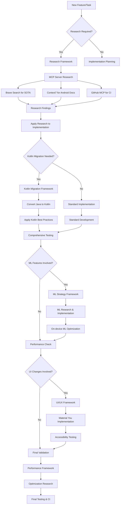

# Framework Integration Guide

**Version:** 2.0 - Unified Documentation System
**Last Updated:** 2025-09-06
**Purpose:** How development frameworks work together in the Echo project

---

## 🎯 Framework Integration Overview

The Echo project uses a coordinated set of development frameworks that work together to ensure research-driven, high-quality development. This document explains how the frameworks integrate and support each other.

### Core Framework Suite

1. **[Research Framework](research-framework.md)** - Overall research-driven development methodology
2. **[Kotlin Migration Framework](kotlin-migration.md)** - Java-to-Kotlin conversion methodology
3. **[ML Strategy Framework](ml-strategy.md)** - ML implementation and research strategy
4. **[Performance Framework](performance-framework.md)** - Performance optimization research
5. **[UI/UX Framework](ui-ux-framework.md)** - Professional UI development framework

---

## 🔄 Framework Integration Flow

### Development Workflow Integration



### Integration Points

#### 1. Research Framework → All Frameworks
- **Primary Integration**: Research framework provides methodology for all other frameworks
- **MCP Integration**: Defines when and how to use MCP servers
- **Quality Assurance**: Research validation requirements for all implementations

#### 2. Kotlin Migration → UI/UX Framework
- **Dependency**: UI framework benefits from Kotlin's modern features
- **Type Safety**: Kotlin's null safety improves UI reliability
- **Functional Programming**: Better state management in UI components

#### 3. ML Strategy → Performance Framework
- **Resource Optimization**: ML implementations need performance optimization
- **Battery Efficiency**: ML processing impacts device battery life
- **Memory Management**: ML models require careful memory optimization

#### 4. Performance Framework → All Frameworks
- **Cross-cutting Concern**: Performance optimization applies to all code
- **Measurement Integration**: Performance metrics for all implementations
- **Optimization Research**: Performance research informs all technical decisions

---

## 🤖 MCP Server Integration Strategy

### Research Phase Integration

#### Brave Search MCP Usage
**When to Use**: All significant technical decisions
- **Kotlin Migration**: Research modern Kotlin patterns and best practices
- **ML Strategy**: Find SOTA ML techniques for mobile devices
- **Performance**: Research optimization techniques and benchmarks
- **UI/UX**: Study modern Android design patterns and accessibility

#### Context7 MCP Usage
**When to Use**: Android-specific implementation guidance
- **Kotlin Migration**: Android Kotlin API documentation and examples
- **ML Strategy**: TensorFlow Lite and ML Kit documentation
- **UI/UX**: Jetpack Compose and Material You documentation
- **Performance**: Android performance optimization guides

#### GitHub MCP Usage
**When to Use**: CI/CD monitoring and validation
- **All Frameworks**: Monitor CI results for implementation validation
- **Testing**: Download test artifacts and analyze failures
- **Performance**: Monitor performance regression in CI
- **Integration**: Validate framework integration through CI

### Framework-Specific MCP Integration

#### Kotlin Migration Framework + MCP
```kotlin
// Research Phase
brave_search({
  query: "Android Kotlin data class best practices 2024"
})

// Implementation Phase
context7_get_docs({
  library: "/android/kotlin",
  topic: "data classes and serialization"
})

// Validation Phase
github_list_workflow_runs({
  workflow: "kotlin-migration-ci.yml"
})
```

#### ML Strategy Framework + MCP
```kotlin
// Research Phase
brave_search({
  query: "on-device speech recognition mobile optimization 2024"
})

// Implementation Phase
context7_get_docs({
  library: "/android/ml",
  topic: "TensorFlow Lite integration"
})

// Performance Validation
github_download_artifacts({
  workflow_run: "ml-performance-test"
})
```

---

## 📊 Quality Assurance Integration

### Testing Strategy Across Frameworks

#### Unit Testing Integration
- **Kotlin Migration**: Tests for converted classes
- **ML Strategy**: Tests for ML model integration
- **UI/UX**: Tests for UI component behavior
- **Performance**: Tests for performance benchmarks

#### Integration Testing Integration
- **Cross-Framework**: Tests for framework interactions
- **End-to-End**: Tests for complete feature workflows
- **Performance**: Tests for system-level performance

#### CI/CD Integration
- **Automated Testing**: All frameworks include CI validation
- **Performance Monitoring**: CI includes performance regression tests
- **Quality Gates**: CI enforces quality standards across frameworks

### Documentation Integration

#### Change Log Integration
All frameworks contribute to unified change log:
- Research findings and sources
- Implementation decisions and rationale
- Testing results and coverage
- Performance impact and optimizations

#### Cross-Framework References
- Research framework referenced in all other frameworks
- Kotlin migration referenced in UI/UX framework
- ML strategy referenced in performance framework
- Performance framework provides metrics for all frameworks

---

## 🎯 Decision Framework Integration

### Priority Decision Matrix

#### TIER 1 Decisions (Critical Errors)
- **Research Framework**: Use MCP tools for error diagnosis
- **All Frameworks**: Pause until TIER 1 resolved
- **Documentation**: Record error resolution in change log

#### TIER 2 Decisions (Incremental Improvements)
- **Research Framework**: Research best practices for implementation
- **Specific Framework**: Apply relevant framework methodology
- **MCP Integration**: Use appropriate MCP servers for research
- **Testing**: Comprehensive testing per framework requirements

#### TIER 3 Decisions (Advanced Features)
- **Multiple Frameworks**: May require coordination between frameworks
- **Research Framework**: Extensive research for complex features
- **Performance Framework**: Performance impact assessment
- **ML Strategy**: For ML-related advanced features

### Framework Selection Guide

#### For Kotlin Migration Tasks
1. **Research Framework**: Research modern Kotlin patterns
2. **Kotlin Migration Framework**: Apply conversion methodology
3. **Performance Framework**: Ensure no performance regression
4. **Testing**: Comprehensive unit and integration tests

#### For ML Implementation Tasks
1. **Research Framework**: Research SOTA ML techniques
2. **ML Strategy Framework**: Apply ML implementation methodology
3. **Performance Framework**: Optimize for mobile constraints
4. **Kotlin Migration**: Ensure Kotlin-first implementation

#### For UI/UX Enhancement Tasks
1. **Research Framework**: Research modern Android design
2. **UI/UX Framework**: Apply professional design methodology
3. **Kotlin Migration**: Leverage Kotlin's UI advantages
4. **Performance Framework**: Optimize UI performance

---

## 📈 Success Metrics Integration

### Framework Health Metrics

#### Research Framework Metrics
- **MCP Usage Rate**: Target 15-20 Context7 uses per week
- **Research Quality**: 80%+ of research queries return useful results
- **Implementation Success**: 90%+ of research-informed implementations successful

#### Kotlin Migration Framework Metrics
- **Conversion Rate**: 100% of Java files converted to Kotlin
- **Test Coverage**: 100% test coverage for converted classes
- **Performance Impact**: No performance regression from conversions
- **Build Success**: 100% compilation success rate maintained

#### ML Strategy Framework Metrics
- **Model Performance**: Meet or exceed research-established benchmarks
- **Resource Usage**: Stay within mobile device constraints
- **Integration Success**: Successful ML feature integration
- **User Experience**: Positive impact on user experience

#### Performance Framework Metrics
- **Optimization Success**: Measurable performance improvements
- **Battery Impact**: Minimal battery life impact
- **Memory Usage**: Efficient memory utilization
- **Benchmark Achievement**: Meet performance targets

#### UI/UX Framework Metrics
- **Accessibility Compliance**: WCAG 2.1 AA compliance
- **User Satisfaction**: Positive user feedback on UI changes
- **Performance**: Smooth UI interactions and animations
- **Material You Adoption**: Consistent design system implementation

### Cross-Framework Metrics

#### Development Efficiency
- **Time Savings**: Reduced research time through MCP integration
- **Error Reduction**: Fewer implementation errors through research
- **Quality Improvement**: Higher code quality through frameworks
- **Delivery Speed**: Faster feature delivery with frameworks

#### Project Health
- **Build Stability**: Consistent build success rates
- **Test Reliability**: High test pass rates maintained
- **Performance**: No performance regressions
- **Maintainability**: Improved code maintainability

---

## 🚀 Framework Evolution Strategy

### Continuous Improvement
- **Research Updates**: Regularly update research findings
- **Framework Refinement**: Improve frameworks based on usage experience
- **MCP Optimization**: Optimize MCP server usage patterns
- **Metrics Review**: Quarterly review of framework effectiveness

### Future Framework Additions
- **Security Framework**: For security research and implementation
- **Testing Framework**: Advanced testing methodologies
- **DevOps Framework**: CI/CD and deployment optimization
- **Monitoring Framework**: Application monitoring and analytics

### Framework Maintenance
- **Documentation Updates**: Keep framework documentation current
- **Training Integration**: Include framework training in onboarding
- **Community Integration**: Share successful patterns with community
- **Tool Integration**: Integrate with new development tools

---

*This framework integration guide ensures all development frameworks work together effectively. For individual framework details, see the specific framework documentation. For current project status, see `docs/project-state/current-status.md`.*