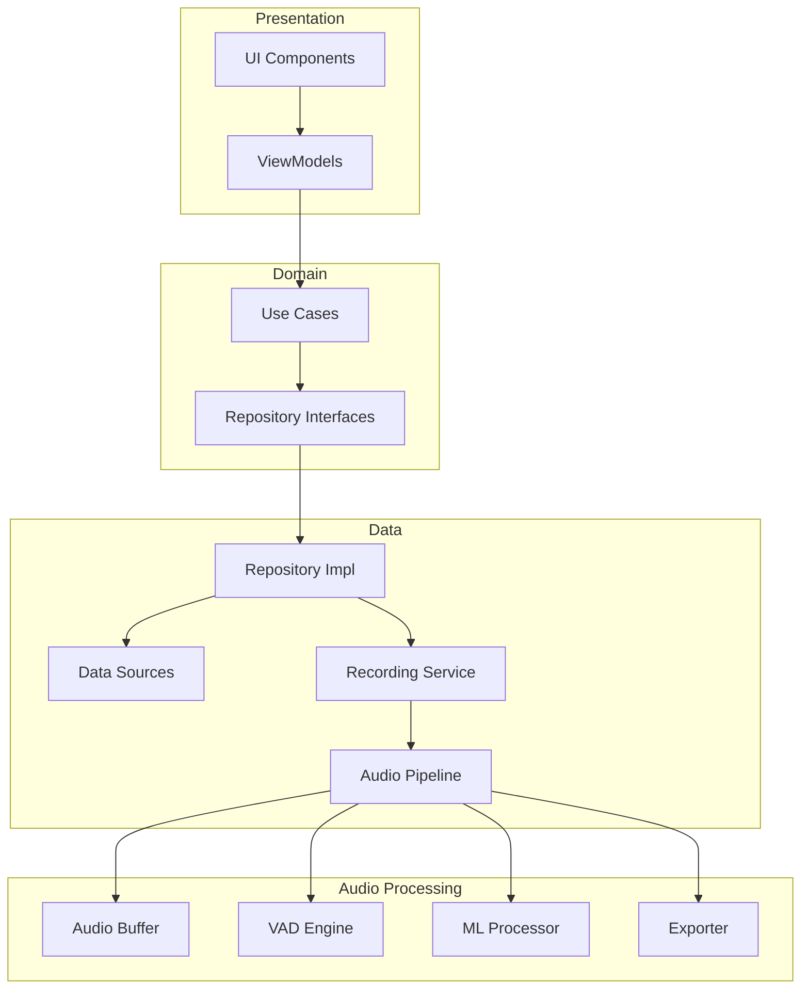

# Echo Android Application Refactoring Plan

## 1. Executive Summary & Architectural Vision

### 1.1 Current State Assessment

After comprehensive analysis of the Echo codebase, the following critical architectural issues have been identified:

**Primary Weaknesses:**
- **Monolithic Service Architecture**: `SaidItService` (~600 lines) handles recording, processing, storage, and export—violating single responsibility principle
- **Tight Coupling**: Direct dependencies between UI, Service, and data layers with no abstraction boundaries
- **Legacy Implementation**: Java-based codebase lacking modern Android patterns (MVVM, LiveData, Coroutines)
- **Poor State Management**: Manual state tracking with broadcast receivers instead of reactive patterns
- **Testing Fragility**: Thread management issues causing test timeouts and file locking problems
- **Memory Management**: Direct ByteBuffer manipulation without proper lifecycle awareness
- **No Dependency Injection**: Manual instantiation making testing and modularity difficult

**Performance & Stability Issues:**
- Gradle build timeouts during test execution
- File locking preventing proper test cleanup
- Thread synchronization issues in tests
- Manual thread management prone to memory leaks

### 1.2 Proposed Architecture

**Modern Clean Architecture with MVVM Pattern**

The refactored application will implement a modular Clean Architecture with clear separation of concerns:

```
┌─────────────────────────────────────────────────────────────┐
│                     Presentation Layer                       │
│  ┌──────────────┐  ┌──────────────┐  ┌──────────────┐     │
│  │   Activities  │  │   Fragments  │  │  ViewModels  │     │
│  └──────────────┘  └──────────────┘  └──────────────┘     │
└─────────────────────────────────────────────────────────────┘
                              │
                              ▼
┌─────────────────────────────────────────────────────────────┐
│                      Domain Layer                           │
│  ┌──────────────┐  ┌──────────────┐  ┌──────────────┐     │
│  │  Use Cases   │  │   Entities   │  │ Repositories │     │
│  │              │  │              │  │  Interfaces  │     │
│  └──────────────┘  └──────────────┘  └──────────────┘     │
└─────────────────────────────────────────────────────────────┘
                              │
                              ▼
┌─────────────────────────────────────────────────────────────┐
│                       Data Layer                            │
│  ┌──────────────┐  ┌──────────────┐  ┌──────────────┐     │
│  │ Repositories │  │ Data Sources │  │   Services   │     │
│  │    Impl      │  │              │  │              │     │
│  └──────────────┘  └──────────────┘  └──────────────┘     │
└─────────────────────────────────────────────────────────────┘
```

**Module Structure:**
```
echo/
├── app/                    # Application module
├── core/                   # Shared utilities and base classes
│   ├── common/            # Common utilities
│   ├── di/                # Dependency injection modules
│   └── audio/             # Audio utilities
├── domain/                # Business logic
│   ├── model/             # Domain entities
│   ├── repository/        # Repository interfaces
│   └── usecase/           # Use cases
├── data/                  # Data implementation
│   ├── repository/        # Repository implementations
│   ├── datasource/        # Local/remote data sources
│   └── service/           # Android services
├── features/              # Feature modules
│   ├── recorder/          # Recording feature
│   ├── playback/          # Playback feature
│   └── settings/          # Settings feature
└── ml/                    # Machine learning module
```

### 1.3 High-Level Architecture Diagram



## 2. Detailed Architectural Refactoring Roadmap

### Phase 1: Foundation & Project Cleanup (Week 1-2)

#### 1.1 Build & Dependency Health

**Gradle Configuration Updates:**

```gradle
// build.gradle (root)
plugins {
    id 'com.android.application' version '8.7.0' apply false
    id 'com.android.library' version '8.7.0' apply false
    id 'org.jetbrains.kotlin.android' version '1.9.22' apply false
    id 'com.google.dagger.hilt.android' version '2.50' apply false
}

// gradle/libs.versions.toml
[versions]
agp = "8.7.0"
kotlin = "1.9.22"
coroutines = "1.7.3"
hilt = "2.50"
androidx-core = "1.12.0"
androidx-lifecycle = "2.7.0"
androidx-room = "2.6.1"
junit = "4.13.2"
mockito = "5.8.0"
robolectric = "4.11.1"
turbine = "1.0.0"

[libraries]
kotlin-stdlib = { module = "org.jetbrains.kotlin:kotlin-stdlib", version.ref = "kotlin" }
coroutines-core = { module = "org.jetbrains.kotlinx:kotlinx-coroutines-core", version.ref = "coroutines" }
coroutines-android = { module = "org.jetbrains.kotlinx:kotlinx-coroutines-android", version.ref = "coroutines" }
hilt-android = { module = "com.google.dagger:hilt-android", version.ref = "hilt" }
hilt-compiler = { module = "com.google.dagger:hilt-compiler", version.ref = "hilt" }
androidx-core-ktx = { module = "androidx.core:core-ktx", version.ref = "androidx-core" }
androidx-lifecycle-viewmodel = { module = "androidx.lifecycle:lifecycle-viewmodel-ktx", version.ref = "androidx-lifecycle" }
androidx-lifecycle-livedata = { module = "androidx.lifecycle:lifecycle-livedata-ktx", version.ref = "androidx-lifecycle" }
androidx-room-runtime = { module = "androidx.room:room-runtime", version.ref = "androidx-room" }
androidx-room-ktx = { module = "androidx.room:room-ktx", version.ref = "androidx-room" }
androidx-room-compiler = { module = "androidx.room:room-compiler", version.ref = "androidx-room" }
junit = { module = "junit:junit", version.ref = "junit" }
mockito-core = { module = "org.mockito:mockito-core", version.ref = "mockito" }
mockito-kotlin = { module = "org.mockito.kotlin:mockito-kotlin", version = "5.2.1" }
robolectric = { module = "org.robolectric:robolectric", version.ref = "robolectric" }
turbine = { module = "app.cash.turbine:turbine", version.ref = "turbine" }

[bundles]
kotlin = ["kotlin-stdlib", "coroutines-core", "coroutines-android"]
androidx-lifecycle = ["androidx-lifecycle-viewmodel", "androidx-lifecycle-livedata"]
room = ["androidx-room-runtime", "androidx-room-ktx"]
testing = ["junit", "mockito-core", "mockito-kotlin", "robolectric", "turbine"]
```

**Module Creation Script:**

```kotlin
// buildSrc/src/main/kotlin/ModuleSetup.kt
fun Project.setupAndroidModule(
    namespace: String,
    isLibrary: Boolean = true
) {
    if (isLibrary) {
        apply(plugin = "com.android.library")
    } else {
        apply(plugin = "com.android.application")
    }
    apply(plugin = "org.jetbrains.kotlin.android")
    apply(plugin = "kotlin-kapt")
    
    android {
        this.namespace = namespace
        compileSdk = 34
        
        defaultConfig {
            minSdk = 30
            targetSdk = 34
            testInstrumentationRunner = "androidx.test.runner.AndroidJUnitRunner"
        }
        
        compileOptions {
            sourceCompatibility = JavaVersion.VERSION_17
            targetCompatibility = JavaVersion.VERSION_17
        }
        
        kotlinOptions {
            jvmTarget = "17"
        }
    }
}
```

#### 1.2 Modularization

**Step-by-Step Module Creation:**

1. **Create Core Module:**
```kotlin
// core/build.gradle.kts
plugins {
    id("com.android.library")
    id("org.jetbrains.kotlin.android")
}

setupAndroidModule("com.echo.core")

dependencies {
    implementation(libs.bundles.kotlin)
    api(libs.androidx.core.ktx)
    api(libs.timber)
}
```

2. **Create Domain Module:**
```kotlin
// domain/build.gradle.kts
plugins {
    id("java-library")
    id("org.jetbrains.kotlin.jvm")
}

dependencies {
    implementation(libs.kotlin.stdlib)
    implementation(libs.coroutines.core)
}
```

3. **Create Data Module:**
```kotlin
// data/build.gradle.kts
plugins {
    id("com.android.library")
    id("org.jetbrains.kotlin.android")
    id("dagger.hilt.android.plugin")
    id("kotlin-kapt")
}

setupAndroidModule("com.echo.data")

dependencies {
    implementation(project(":core"))
    implementation(project(":domain"))
    implementation(libs.bundles.kotlin)
    implementation(libs.hilt.android)
    kapt(libs.hilt.compiler)
    implementation(libs.bundles.room)
    kapt(libs.androidx.room.compiler)
}
```

### Phase 2: Decoupling the Service & Audio Pipeline (Week 3-4)

#### 2.1 Service Refactoring

**New Lean Recording Service:**

```kotlin
// data/src/main/kotlin/com/echo/data/service/RecordingService.kt
@AndroidEntryPoint
class RecordingService : LifecycleService() {
    
    @Inject lateinit var recordingRepository: RecordingRepository
    @Inject lateinit var notificationManager: RecordingNotificationManager
    
    private val serviceScope = CoroutineScope(SupervisorJob() + Dispatchers.Default)
    
    override fun onCreate() {
        super.onCreate()
        startForeground(NOTIFICATION_ID, notificationManager.createNotification())
    }
    
    override fun onStartCommand(intent: Intent?, flags: Int, startId: Int): Int {
        super.onStartCommand(intent, flags, startId)
        
        intent?.action?.let { action ->
            when (action) {
                ACTION_START_LISTENING -> startListening()
                ACTION_STOP_LISTENING -> stopListening()
                ACTION_START_RECORDING -> startRecording()
                ACTION_STOP_RECORDING -> stopRecording()
            }
        }
        
        return START_STICKY
    }
    
    private fun startListening() {
        serviceScope.launch {
            recordingRepository.startListening()
        }
    }
    
    private fun stopListening() {
        serviceScope.launch {
            recordingRepository.stopListening()
        }
    }
    
    companion object {
        private const val NOTIFICATION_ID = 1001
        const val ACTION_START_LISTENING = "com.echo.action.START_LISTENING"
        const val ACTION_STOP_LISTENING = "com.echo.action.STOP_LISTENING"
        const val ACTION_START_RECORDING = "com.echo.action.START_RECORDING"
        const val ACTION_STOP_RECORDING = "com.echo.action.STOP_RECORDING"
    }
}
```

#### 2.2 Audio Processing Pipeline

**Decoupled Audio Pipeline:**

```kotlin
// data/src/main/kotlin/com/echo/data/audio/AudioPipeline.kt
class AudioPipeline(
    private val config: AudioConfig,
    private val audioBuffer: AudioBuffer,
    private val vadEngine: VadEngine,
    private val mlProcessor: MlProcessor,
    private val segmentationController: SegmentationController
) {
    private val pipelineScope = CoroutineScope(SupervisorJob() + Dispatchers.Default)
    private val audioFlow = MutableSharedFlow<AudioFrame>()
    
    init {
        setupPipeline()
    }
    
    private fun setupPipeline() {
        // Stage 1: VAD Processing
        audioFlow
            .onEach { frame ->
                val isSpeech = vadEngine.process(frame)
                frame.metadata.isSpeech = isSpeech
            }
            .flowOn(Dispatchers.Default)
            // Stage 2: Segmentation
            .onEach { frame ->
                segmentationController.process(frame)
            }
            // Stage 3: ML Classification
            .onEach { frame ->
                if (frame.metadata.isSpeech) {
                    val classifications = mlProcessor.classify(frame)
                    frame.metadata.classifications = classifications
                }
            }
            // Stage 4: Buffer Management
            .onEach { frame ->
                audioBuffer.write(frame)
            }
            .catch { e ->
                Timber.e(e, "Audio pipeline error")
            }
            .launchIn(pipelineScope)
    }
    
    suspend fun process(audioData: ByteArray, offset: Int, length: Int) {
        val frame = AudioFrame(
            data = audioData.copyOfRange(offset, offset + length),
            timestamp = System.currentTimeMillis(),
            metadata = AudioMetadata()
        )
        audioFlow.emit(frame)
    }
    
    fun stop() {
        pipelineScope.cancel()
    }
}
```

**Audio Buffer with Coroutines:**

```kotlin
// data/src/main/kotlin/com/echo/data/audio/AudioBuffer.kt
class AudioBuffer(
    private val config: BufferConfig
) {
    private val ringBuffer = CircularByteBuffer(config.sizeBytes)
    private val mutex = Mutex()
    
    suspend fun write(frame: AudioFrame) = mutex.withLock {
        ringBuffer.put(frame.data)
    }
    
    suspend fun read(bytes: Int): ByteArray = mutex.withLock {
        ringBuffer.get(bytes)
    }
    
    suspend fun dump(seconds: Float): ByteArray = mutex.withLock {
        val bytesToRead = (seconds * config.sampleRate * 2).toInt()
        ringBuffer.dump(bytesToRead)
    }
}
```

#### 2.3 Repository Pattern Implementation

```kotlin
// domain/src/main/kotlin/com/echo/domain/repository/RecordingRepository.kt
interface RecordingRepository {
    suspend fun startListening(): Result<Unit>
    suspend fun stopListening(): Result<Unit>
    suspend fun startRecording(prependSeconds: Float): Result<Unit>
    suspend fun stopRecording(): Result<RecordingInfo>
    suspend fun exportRecording(
        durationSeconds: Float,
        format: ExportFormat,
        fileName: String
    ): Result<Uri>
    fun getRecordingState(): Flow<RecordingState>
}

// data/src/main/kotlin/com/echo/data/repository/RecordingRepositoryImpl.kt
@Singleton
class RecordingRepositoryImpl @Inject constructor(
    private val audioRecorder: AudioRecorder,
    private val audioPipeline: AudioPipeline,
    private val audioBuffer: AudioBuffer,
    private val recordingStore: RecordingStore,
    private val exporter: AudioExporter
) : RecordingRepository {
    
    private val _recordingState = MutableStateFlow(RecordingState.IDLE)
    override fun getRecordingState(): Flow<RecordingState> = _recordingState.asStateFlow()
    
    override suspend fun startListening(): Result<Unit> = withContext(Dispatchers.IO) {
        runCatching {
            audioRecorder.startRecording { audioData, offset, length ->
                runBlocking {
                    audioPipeline.process(audioData, offset, length)
                }
            }
            _recordingState.value = RecordingState.LISTENING
        }
    }
    
    override suspend fun stopListening(): Result<Unit> = withContext(Dispatchers.IO) {
        runCatching {
            audioRecorder.stopRecording()
            _recordingState.value = RecordingState.IDLE
        }
    }
    
    override suspend fun startRecording(prependSeconds: Float): Result<Unit> = 
        withContext(Dispatchers.IO) {
            runCatching {
                val prependData = audioBuffer.dump(prependSeconds)
                recordingStore.startRecording(prependData)
                _recordingState.value = RecordingState.RECORDING
            }
        }
    
    override suspend fun stopRecording(): Result<RecordingInfo> = 
        withContext(Dispatchers.IO) {
            runCatching {
                val recordingInfo = recordingStore.stopRecording()
                _recordingState.value = RecordingState.LISTENING
                recordingInfo
            }
        }
    
    override suspend fun exportRecording(
        durationSeconds: Float,
        format: ExportFormat,
        fileName: String
    ): Result<Uri> = withContext(Dispatchers.IO) {
        runCatching {
            val audioData = audioBuffer.dump(durationSeconds)
            exporter.export(audioData, format, fileName)
        }
    }
}
```

### Phase 3: Modernizing the UI Layer (Week 5-6)

#### 3.1 MVVM Implementation

**Recording ViewModel:**

```kotlin
// features/recorder/src/main/kotlin/com/echo/features/recorder/RecordingViewModel.kt
@HiltViewModel
class RecordingViewModel @Inject constructor(
    private val startListening: StartListeningUseCase,
    private val stopListening: StopListeningUseCase,
    private val startRecording: StartRecordingUseCase,
    private val stopRecording: StopRecordingUseCase,
    private val exportRecording: ExportRecordingUseCase,
    private val getRecordingState: GetRecordingStateUseCase
) : ViewModel() {
    
    private val _uiState = MutableStateFlow(RecordingUiState())
    val uiState: StateFlow<RecordingUiState> = _uiState.asStateFlow()
    
    init {
        observeRecordingState()
    }
    
    private fun observeRecordingState() {
        getRecordingState()
            .onEach { state ->
                _uiState.update { it.copy(recordingState = state) }
            }
            .launchIn(viewModelScope)
    }
    
    fun onListeningToggled(enabled: Boolean) {
        viewModelScope.launch {
            _uiState.update { it.copy(isLoading = true) }
            
            val result = if (enabled) {
                startListening()
            } else {
                stopListening()
            }
            
            result.fold(
                onSuccess = {
                    _uiState.update { 
                        it.copy(
                            isLoading = false,
                            isListening = enabled
                        )
                    }
                },
                onFailure = { error ->
                    _uiState.update {
                        it.copy(
                            isLoading = false,
                            error = error.message
                        )
                    }
                }
            )
        }
    }
    
    fun onRecordButtonClicked() {
        viewModelScope.launch {
            when (_uiState.value.recordingState) {
                RecordingState.LISTENING -> {
                    startRecording(prependSeconds = 5f).fold(
                        onSuccess = {
                            _uiState.update { it.copy(isRecording = true) }
                        },
                        onFailure = { error ->
                            _uiState.update { it.copy(error = error.message) }
                        }
                    )
                }
                RecordingState.RECORDING -> {
                    stopRecording().fold(
                        onSuccess = { recordingInfo ->
                            _uiState.update { 
                                it.copy(
                                    isRecording = false,
                                    lastRecording = recordingInfo
                                )
                            }
                        },
                        onFailure = { error ->
                            _uiState.update { it.copy(error = error.message) }
                        }
                    )
                }
                else -> Unit
            }
        }
    }
    
    fun onSaveClip(fileName: String, durationSeconds: Float) {
        viewModelScope.launch {
            _uiState.update { it.copy(isExporting = true) }
            
            exportRecording(durationSeconds, ExportFormat.AAC, fileName).fold(
                onSuccess = { uri ->
                    _uiState.update {
                        it.copy(
                            isExporting = false,
                            exportedFileUri = uri
                        )
                    }
                },
                onFailure = { error ->
                    _uiState.update {
                        it.copy(
                            isExporting = false,
                            error = error.message
                        )
                    }
                }
            )
        }
    }
}

data class RecordingUiState(
    val recordingState: RecordingState = RecordingState.IDLE,
    val isListening: Boolean = false,
    val isRecording: Boolean = false,
    val isLoading: Boolean = false,
    val isExporting: Boolean = false,
    val memorizedDuration: Float = 0f,
    val recordedDuration: Float = 0f,
    val lastRecording: RecordingInfo? = null,
    val exportedFileUri: Uri? = null,
    val error: String? = null
)
```

**Updated Fragment with Compose UI:**

```kotlin
// features/recorder/src/main/kotlin/com/echo/features/recorder/RecordingFragment.kt
@AndroidEntryPoint
class RecordingFragment : Fragment() {
    
    private val viewModel: RecordingViewModel by viewModels()
    
    override fun onCreateView(
        inflater: LayoutInflater,
        container: ViewGroup?,
        savedInstanceState: Bundle?
    ): View {
        return ComposeView(requireContext()).apply {
            setViewCompositionStrategy(ViewCompositionStrategy.DisposeOnViewTreeLifecycleDestroyed)
            setContent {
                EchoTheme {
                    RecordingScreen(viewModel)
                }
            }
        }
    }
}

@Composable
fun RecordingScreen(viewModel: RecordingViewModel) {
    val uiState by viewModel.uiState.collectAsStateWithLifecycle()
    
    Scaffold(
        topBar = {
            TopAppBar(
                title = { Text("Echo Recorder") },
                actions = {
                    IconButton(onClick = { /* Navigate to settings */ }) {
                        Icon(Icons.Default.Settings, contentDescription = "Settings")
                    }
                }
            )
        }
    ) { paddingValues ->
        Column(
            modifier = Modifier
                .fillMaxSize()
                .padding(paddingValues),
            horizontalAlignment = Alignment.CenterHorizontally,
            verticalArrangement = Arrangement.Center
        ) {
            // Recording Status
            RecordingStatusCard(
                state = uiState.recordingState,
                memorizedDuration = uiState.memorizedDuration,
                recordedDuration = uiState.recordedDuration
            )
            
            Spacer(modifier = Modifier.height(32.dp))
            
            // Main Controls
            Row(
                horizontalArrangement = Arrangement.spacedBy(16.dp)
            ) {
                // Listening Toggle
                Switch(
                    checked = uiState.isListening,
                    onCheckedChange = viewModel::onListeningToggled,
                    enabled = !uiState.isLoading
                )
                
                // Record Button
                RecordButton(
                    isRecording = uiState.isRecording,
                    onClick = viewModel::onRecordButtonClicked,
                    enabled = uiState.isListening && !uiState.isLoading
                )
                
                // Save Clip Button
                IconButton(
                    onClick = { /* Show save dialog */ },
                    enabled = uiState.memorizedDuration > 0
                ) {
                    Icon(Icons.Default.Save, contentDescription = "Save Clip")
                }
            }
            
            // Error handling
            uiState.error?.let { error ->
                Snackbar {
                    Text(error)
                }
            }
        }
    }
}
```

#### 3.2 Dependency Injection Setup

```kotlin
// di/src/main/kotlin/com/echo/di/AppModule.kt
@Module
@InstallIn(SingletonComponent::class)
object AppModule {
    
    @Provides
    @Singleton
    fun provideAudioConfig(): AudioConfig = AudioConfig(
        sampleRate = 48000,
        channelConfig = AudioFormat.CHANNEL_IN_MONO,
        audioFormat = AudioFormat.ENCODING_PCM_16BIT,
        bufferSize = AudioRecord.getMinBufferSize(48000, AudioFormat.CHANNEL_IN_MONO, AudioFormat.ENCODING_PCM_16BIT)
    )
    
    @Provides
    @Singleton
    fun provideAudioRecorder(config: AudioConfig): AudioRecorder = 
        SystemAudioRecorder(config)
    
    @Provides
    @Singleton
    fun provideAudioBuffer(config: AudioConfig): AudioBuffer = 
        AudioBuffer(BufferConfig(sizeBytes = 4 * 1024 * 1024, sampleRate = config.sampleRate))
    
    @Provides
    @Singleton
    fun provideVadEngine(): VadEngine = WebRtcVadEngine()
    
    @Provides
    @Singleton
    fun provideMlProcessor(@ApplicationContext context: Context): MlProcessor = 
        TfLiteMlProcessor(context)
    
    @Provides
    @Singleton
    fun provideAudioPipeline(
        config: AudioConfig,
        audioBuffer: AudioBuffer,
        vadEngine: VadEngine,
        mlProcessor: MlProcessor,
        segmentationController: SegmentationController
    ): AudioPipeline = AudioPipeline(config, audioBuffer, vadEngine, mlProcessor, segmentationController)
}

@Module
@InstallIn(SingletonComponent::class)
abstract class RepositoryModule {
    
    @Binds
    abstract fun bindRecordingRepository(
        impl: RecordingRepositoryImpl
    ): RecordingRepository
}
```

## 3. Comprehensive Testing Strategy

### 3.1 Unit Tests

**ViewModel Test Example:**

```kotlin
// features/recorder/src/test/kotlin/com/echo/features/recorder/RecordingViewModelTest.kt
class RecordingViewModelTest {
    
    @get:Rule
    val mainDispatcherRule = MainDispatcherRule()
    
    private val startListening: StartListeningUseCase = mockk()
    private val stopListening: StopListeningUseCase = mockk()
    private val startRecording: StartRecordingUseCase = mockk()
    private val stopRecording: StopRecordingUseCase = mockk()
    private val exportRecording: ExportRecordingUseCase = mockk()
    private val getRecordingState: GetRecordingStateUseCase = mockk()
    
    private lateinit var viewModel: RecordingViewModel
    
    @Before
    fun setup() {
        every { getRecordingState() } returns flowOf(RecordingState.IDLE)
        viewModel = RecordingViewModel(
            startListening, stopListening, startRecording,
            stopRecording, exportRecording, getRecordingState
        )
    }
    
    @Test
    fun `when listening toggled on, should start listening`() = runTest {
        // Given
        coEvery { startListening() } returns Result.success(Unit)
        
        // When
        viewModel.onListeningToggled(true)
        
        // Then
        viewModel.uiState.test {
            val state = awaitItem()
            assertTrue(state.isListening)
            assertFalse(state.isLoading)
        }
        
        coVerify { startListening() }
    }
    
    @Test
    fun `when recording started, should update state`() = runTest {
        // Given
        every { getRecordingState() } returns flowOf(RecordingState.LISTENING)
        coEvery { startRecording(any()) } returns Result.success(Unit)
        
        // When
        viewModel.onRecordButtonClicked()
        
        // Then
        viewModel.uiState.test {
            val state = awaitItem()
            assertTrue(state.isRecording)
        }
    }
}
```

**Repository Test Example:**

```kotlin
// data/src/test/kotlin/com/echo/data/repository/RecordingRepositoryImplTest.kt
@RunWith(RobolectricTestRunner::class)
class RecordingRepositoryImplTest {
    
    private val audioRecorder: AudioRecorder = mockk(relaxed = true)
    private val audioPipeline: AudioPipeline = mockk(relaxed = true)
    private val audioBuffer: AudioBuffer = mockk()
    private val recordingStore: RecordingStore = mockk()
    private val exporter: AudioExporter = mockk()
    
    private lateinit var repository: RecordingRepositoryImpl
    
    @Before
    fun setup() {
        repository = RecordingRepositoryImpl(
            audioRecorder, audioPipeline, audioBuffer,
            recordingStore, exporter
        )
    }
    
    @Test
    fun `startListening should start audio recorder and update state`() = runTest {
        // When
        val result = repository.startListening()
        
        // Then
        assertTrue(result.isSuccess)
        verify { audioRecorder.startRecording(any()) }
        
        repository.getRecordingState().test {
            assertEquals(RecordingState.LISTENING, awaitItem())
        }
    }
    
    @Test
    fun `exportRecording should dump buffer and export`() = runTest {
        // Given
        val durationSeconds = 30f
        val format = ExportFormat.AAC
        val fileName = "test_recording"
        val audioData = ByteArray(1000)
        val expectedUri = mockk<Uri>()
        
        coEvery { audioBuffer.dump(durationSeconds) } returns audioData
        coEvery { exporter.export(audioData, format, fileName) } returns expectedUri
        
        // When
        val result = repository.exportRecording(durationSeconds, format, fileName)
        
        // Then
        assertTrue(result.isSuccess)
        assertEquals(expectedUri, result.getOrNull())
    }
}
```

### 3.2 Integration Tests

```kotlin
// data/src/androidTest/kotlin/com/echo/data/audio/AudioPipelineIntegrationTest.kt
@RunWith(AndroidJUnit4::class)
class AudioPipelineIntegrationTest {
    
    private lateinit var pipeline: AudioPipeline
    private lateinit var audioBuffer: AudioBuffer
    
    @Before
    fun setup() {
        val config = AudioConfig(
            sampleRate = 48000,
            channelConfig = AudioFormat.CHANNEL_IN_MONO,
            audioFormat = AudioFormat.ENCODING_PCM_16BIT
        )
        
        audioBuffer = AudioBuffer(BufferConfig(1024 * 1024, config.sampleRate))
        pipeline = AudioPipeline(
            config = config,
            audioBuffer = audioBuffer,
            vadEngine = FakeVadEngine(),
            mlProcessor = FakeMlProcessor(),
            segmentationController = SimpleSegmentationController()
        )
    }
    
    @Test
    fun testAudioProcessingEndToEnd() = runTest {
        // Generate test audio data
        val testAudio = generateTestAudioData(durationMs = 1000)
        
        // Process through pipeline
        pipeline.process(testAudio, 0, testAudio.size)
        
        // Allow processing time
        delay(100)
        
        // Verify data reached buffer
        val bufferedData = audioBuffer.read(testAudio.size)
        assertArrayEquals(testAudio, bufferedData)
    }
}
```

### 3.3 Performance Testing

```kotlin
// data/src/androidTest/kotlin/com/echo/data/performance/AudioPerformanceTest.kt
@RunWith(AndroidJUnit4::class)
class AudioPerformanceTest {
    
    @get:Rule
    val benchmarkRule = BenchmarkRule()
    
    @Test
    fun measureAudioProcessingLatency() {
        val pipeline = createTestPipeline()
        val testData = ByteArray(960) // 20ms @ 48kHz
        
        benchmarkRule.measureRepeated {
            runBlocking {
                pipeline.process(testData, 0, testData.size)
            }
        }
        
        // Assert processing time < 5ms for real-time requirement
        assertTrue(benchmarkRule.stats.medianNanos < 5_000_000)
    }
    
    @Test
    fun measureMemoryUsage() {
        val runtime = Runtime.getRuntime()
        val beforeMemory = runtime.totalMemory() - runtime.freeMemory()
        
        // Create and use audio components
        val buffer = AudioBuffer(BufferConfig(4 * 1024 * 1024, 48000))
        repeat(1000) {
            runBlocking {
                buffer.write(AudioFrame(ByteArray(960), System.currentTimeMillis(), AudioMetadata()))
            }
        }
        
        val afterMemory = runtime.totalMemory() - runtime.freeMemory()
        val memoryUsed = afterMemory - beforeMemory
        
        // Assert memory usage < 200MB
        assertTrue(memoryUsed < 200 * 1024 * 1024)
    }
}
```

## 4. Fixing Critical Build & Test Issues

### 4.1 Timeout Resolution

**Root Cause Analysis:**
- HandlerThread not properly terminated in tests
- Synchronous waits on audio thread causing deadlocks
- Robolectric shadow loopers not advancing properly

**Solution:**

```kotlin
// data/src/test/kotlin/com/echo/data/TestUtils.kt
object TestUtils {
    
    @JvmStatic
    fun setupCoroutineTest() = TestCoroutineRule()
    
    class TestCoroutineRule : TestWatcher() {
        val testDispatcher = StandardTestDispatcher()
        
        override fun starting(description: Description) {
            Dispatchers.setMain(testDispatcher)
        }
        
        override fun finished(description: Description) {
            Dispatchers.resetMain()
        }
    }
    
    // Proper service cleanup for tests
    fun cleanupService(service: Service) {
        service.stopSelf()
        shadowOf(Looper.getMainLooper()).idle()
    }
}

// Updated test configuration
// gradle.properties
org.gradle.jvmargs=-Xmx4g -XX:+UseParallelGC
org.gradle.parallel=true
org.gradle.caching=true
org.gradle.daemon=true
android.enableJetifier=false
android.nonFinalResIds=false
android.nonTransitiveRClass=true
android.useAndroidX=true

// Test timeout configuration
android {
    testOptions {
        unitTests {
            all {
                testLogging {
                    events "passed", "skipped", "failed"
                }
                maxHeapSize = "2g"
                forkEvery = 100
                maxParallelForks = 4
            }
        }
        
        // Increase timeout for instrumented tests
        animationsDisabled = true
        execution = "ANDROIDX_TEST_ORCHESTRATOR"
    }
}
```

### 4.2 File Lock Resolution

**Problem:** Tests leave file handles open, preventing cleanup

**Solution:**

```kotlin
// data/src/test/kotlin/com/echo/data/FileTestUtils.kt
object FileTestUtils {
    
    @Rule
    @JvmField
    val tempFolder = TemporaryFolder()
    
    fun createTestFile(name: String): File {
        return tempFolder.newFile(name)
    }
    
    // Ensure proper resource cleanup
    inline fun <T> useTestFile(name: String, block: (File) -> T): T {
        val file = createTestFile(name)
        return try {
            block(file)
        } finally {
            file.delete()
        }
    }
    
    // Force close all file streams
    fun forceCleanup() {
        System.gc()
        System.runFinalization()
        Thread.sleep(100)
    }
}

// Updated AAC Writer with proper resource management
class AacMp4Writer(
    private val file: File,
    private val config: AudioConfig
) : AutoCloseable {
    
    private val mediaMuxer: MediaMuxer by lazy {
        MediaMuxer(file.absolutePath, MediaMuxer.OutputFormat.MUXER_OUTPUT_MPEG_4)
    }
    
    private var isReleased = false
    
    @Synchronized
    override fun close() {
        if (!isReleased) {
            try {
                mediaMuxer.stop()
                mediaMuxer.release()
            } catch (e: Exception) {
                Timber.e(e, "Error closing AAC writer")
            } finally {
                isReleased = true
            }
        }
    }
    
    protected fun finalize() {
        close()
    }
}
```

## 5. Implementation Timeline & Milestones

### Week 1-2: Foundation
- [ ] Migrate build system to Kotlin DSL and version catalogs
- [ ] Create module structure
- [ ] Setup dependency injection with Hilt
- [ ] Convert core classes to Kotlin

### Week 3-4: Service & Audio Pipeline
- [ ] Implement lean RecordingService
- [ ] Create decoupled AudioPipeline
- [ ] Implement Repository pattern
- [ ] Setup Coroutines for async operations

### Week 5-6: UI Modernization
- [ ] Implement MVVM architecture
- [ ] Create ViewModels with StateFlow
- [ ] Migrate to Jetpack Compose (optional)
- [ ] Setup UI state management

### Week 7: Testing & Stabilization
- [ ] Write comprehensive unit tests
- [ ] Implement integration tests
- [ ] Fix file locking and timeout issues
- [ ] Performance profiling and optimization

### Week 8: Advanced Features
- [ ] Integrate FFmpeg for advanced processing
- [ ] Implement RNNoise integration
- [ ] Setup on-device ML with Whisper
- [ ] Implement progressive quality degradation

## 6. Performance Optimization Guidelines

### Memory Management
- Use object pools for frequently allocated objects
- Implement lazy initialization for heavy components
- Use DirectByteBuffer for audio data
- Properly scope coroutines to prevent leaks

### CPU Optimization
- Process audio in chunks (20ms frames)
- Use native code for intensive operations
- Implement backpressure in audio pipeline
- Cache ML model outputs

### Battery Optimization
- Use WorkManager for background tasks
- Implement Doze mode compatibility
- Batch network operations
- Use efficient wake lock management

## 7. Migration Strategy

### Phase 1: Parallel Development
1. Keep existing Java code functional
2. Build new Kotlin modules alongside
3. Create adapters between old and new code
4. Gradually migrate features

### Phase 2: Feature Flag Rollout
```kotlin
object FeatureFlags {
    val useNewAudioPipeline = BuildConfig.DEBUG
    val useComposeUi = false
    val useCoroutines = true
}
```

### Phase 3: Complete Migration
1. Remove legacy Java code
2. Optimize module boundaries
3. Update documentation
4. Release stable version

## Conclusion

This comprehensive refactoring plan transforms the Echo application from a monolithic, tightly-coupled Java application into a modern, modular, and testable Kotlin application. The proposed architecture ensures:

- **Scalability**: Modular design allows independent feature development
- **Testability**: Dependency injection and clean architecture enable comprehensive testing
- **Performance**: Modern concurrency patterns and optimized audio pipeline
- **Maintainability**: Clear separation of concerns and modern Android patterns
- **Stability**: Proper resource management and error handling

The phased approach minimizes risk while delivering incremental improvements, ultimately achieving the goal of a production-ready, high-performance audio recording application capable of supporting advanced features like real-time ML processing and 24/7 background recording.